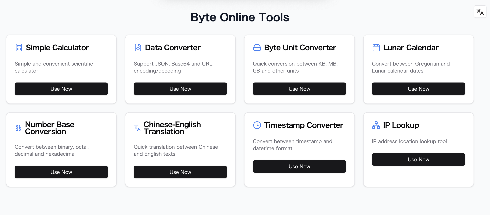

# 现代 Web 工具箱

一个现代化的 Web 应用，集成了多种实用工具，包括计算器、数据转换、字节转换、进制转换、翻译、时间戳转换、IP 查询、Favicon 提取、世界时钟等。基于 Next.js 14+ 和 TypeScript 构建。

⭐ 如果你觉得本项目有用，请在 GitHub 上点个 Star！你的支持将帮助我们持续改进。

[English](README.md) | [中文](README-zh.md)



## 功能特性

- 🧮 计算器（基础四则运算）
- 🔄 数据转换（JSON 格式化/压缩，Base64 编解码，URL 编解码）
- 💾 字节转换（B, KB, MB, GB, TB, PB 互转）
- 🔢 进制转换（多种进制互转）
- 🌐 翻译（中英文互译）
- 🕒 时间戳转换（日期/时间戳互转，实时时钟）
- 🌍 世界时钟（多时区显示）
- 📡 IP 查询（查询 IP、地理位置、运营商等）
- 🖼️ Favicon 提取（通过网址获取网站 Favicon）
- 🌓 暗黑/明亮模式支持
- 🌏 国际化支持（中英文）
- 💅 响应式设计，适配多端

## 在线体验

> 部署后请补充线上演示地址

## 快速开始

### 一键部署到 Vercel

[](https://vercel.com/new/clone?repository-url=https://github.com/shadowDragons/toolbox)

### 本地开发

1. 克隆仓库

```bash
git clone https://github.com/shadowDragons/toolbox.git
cd toolbox
```

2. 安装依赖

```bash
npm install
# 或
yarn install
# 或
pnpm install
```

3. 配置环境变量

```bash
cp .env.example .env.local
```

4. 启动开发服务器

```bash
npm run dev
# 或
yarn dev
# 或
pnpm dev
```

在浏览器中打开 [http://localhost:3000](http://localhost:3000) 查看效果。

## 环境变量

在项目根目录下创建 `.env.local` 文件，内容如下：

```env
DEEPL_AUTH_KEY=你的Deeplkey
```

## 技术栈

- [Next.js 14](https://nextjs.org/) - React 框架
- [TypeScript](https://www.typescriptlang.org/) - 类型安全
- [Tailwind CSS](https://tailwindcss.com/) - 样式
- [next-intl](https://next-intl-docs.vercel.app/) - 国际化
- [next-themes](https://github.com/pacocoursey/next-themes) - 主题管理

## 项目结构

```
.
├── src/
│   ├── app/ # Next.js 应用目录与页面
│   ├── libs/ # 工具函数
│   ├── i18n/ # 国际化辅助
├── messages/ # 多语言翻译文件
├── public/ # 静态资源
└── styles/ # 全局样式
```

## 贡献指南

欢迎任何形式的贡献！如有重大更改建议，请先提交 Issue 讨论。

1. Fork 本仓库
2. 创建你的分支 (`git checkout -b feature/你的功能`)
3. 提交更改 (`git commit -m '添加新功能'`)
4. 推送到远程分支 (`git push origin feature/你的功能`)
5. 提交 Pull Request

## 许可证

本项目基于 MIT 协议开源，详见 [LICENSE](LICENSE) 文件。

## 作者

Junexus ([https://sphrag.com](https://sphrag.com))

## 支持项目

如果你觉得本项目对你有帮助，欢迎请作者喝咖啡：

[](https://sphrag.com/zh/sponsor)

## 规划路线

- [ ] 社交媒体卡片
- [ ] 文章封面生成
- [ ] 多字体支持
- [ ] Emoji 支持
- [ ] 更多实用工具

## 鸣谢

- [Next.js](https://nextjs.org/)
- [Tailwind CSS](https://tailwindcss.com/)
- [next-intl](https://next-intl-docs.vercel.app/)