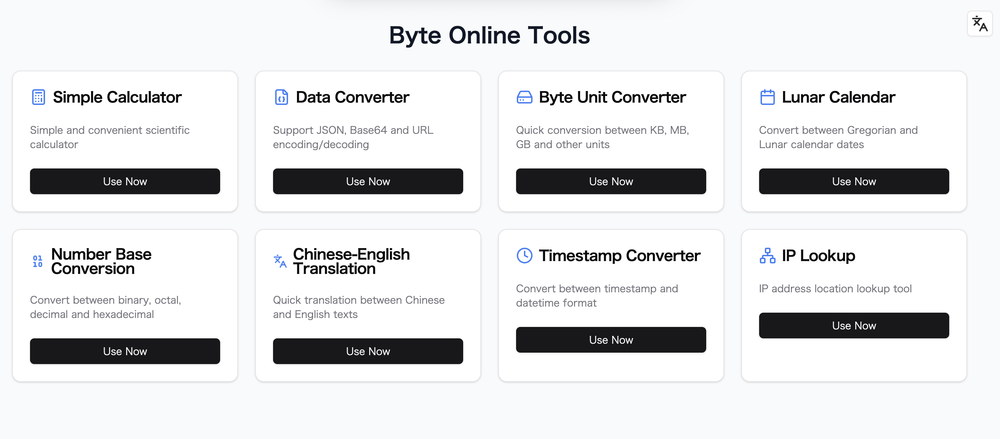

# Modern Web Tools Suite

A modern web application providing a suite of practical tools, including calculator, data converter, byte converter, number converter, translator, timestamp converter, IP lookup, favicon extractor, and world clock. Built with Next.js 14+ and TypeScript.

⭐ If you find this project useful, please consider giving it a star on GitHub! Your support helps us grow and improve the project.

[English](README.md) | [中文](README-zh.md)



## Features

- 🧮 Calculator (basic arithmetic)
- 🔄 Data Converter (JSON format/minify, Base64 encode/decode, URL encode/decode)
- 💾 Byte Converter (convert between B, KB, MB, GB, TB, PB)
- 🔢 Number Converter (various number system conversions)
- 🌐 Translator (Chinese/English translation)
- 🕒 Timestamp Converter (date/timestamp mutual conversion, real-time clock)
- 🌍 World Clock (multi-timezone display)
- 📡 IP Lookup (query IP address, location, ISP, etc.)
- 🖼️ Favicon Extractor (get website favicon by URL)
- 🌓 Dark/Light mode support
- 🌏 i18n support (English & Chinese)
- 💅 Responsive design with Tailwind CSS

## Quick Start

### Deploy on Vercel

[](https://vercel.com/new/clone?repository-url=https://github.com/shadowDragons/toolbox)

### Local Development

1. Clone the repository

```bash
git clone https://github.com/shadowDragons/toolbox.git
cd toolbox
```

2. Install dependencies

```bash
npm install
# or
yarn install
# or
pnpm install
```

3. Create environment variables file

```bash
cp .env.example .env.local
```

4. Start the development server

```bash
npm run dev
# or
yarn dev
# or
pnpm dev
```

Open [http://localhost:3000](http://localhost:3000) with your browser to see the result.

## Environment Variables

Create a `.env.local` file in the root directory with the following variables:

```env
DEEPL_AUTH_KEY=your-deepl-key
```

## Tech Stack

- [Next.js 14](https://nextjs.org/) - React framework
- [TypeScript](https://www.typescriptlang.org/) - Type safety
- [Tailwind CSS](https://tailwindcss.com/) - Styling
- [next-intl](https://next-intl-docs.vercel.app/) - Internationalization
- [next-themes](https://github.com/pacocoursey/next-themes) - Theme management

## Project Structure

```
.
├── src/
│   ├── app/ # Next.js app directory & pages
│   ├── libs/ # Utility functions
│   ├── i18n/ # Internationalization helpers
├── messages/ # i18n translation files
├── public/ # Static assets
└── styles/ # Global styles
```

## Contributing

We welcome contributions! Please feel free to submit a Pull Request. For major changes, please open an issue first to discuss what you would like to change.

1. Fork the repository
2. Create your feature branch (`git checkout -b feature/AmazingFeature`)
3. Commit your changes (`git commit -m 'Add some AmazingFeature'`)
4. Push to the branch (`git push origin feature/AmazingFeature`)
5. Open a Pull Request

## License

This project is licensed under the MIT License - see the [LICENSE](LICENSE) file for details.

## Author

Junexus ([https://sphrag.com](https://sphrag.com))

## Support

If you find this project helpful, consider buying me a coffee:

[](https://sphrag.com/en/sponsor)

## Roadmap

- [ ] Social Media Cards
- [ ] Article Covers
- [ ] Multiple Font Support
- [ ] Emoji Support
- [ ] More practical tools

## Acknowledgments

- [Next.js](https://nextjs.org/)
- [Tailwind CSS](https://tailwindcss.com/)
- [next-intl](https://next-intl-docs.vercel.app/)
